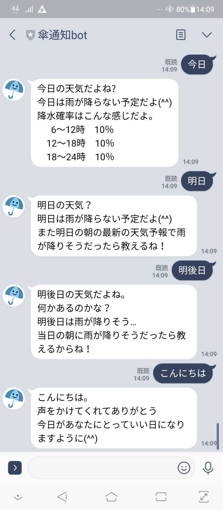

傘通知bot
====

Overview

## Description
降水確率50%を超える時間帯がある場合、傘を持っていくことを通知するlinebotです
 (傘が必要な場合のみ朝に通知が来ます)。

気象庁のデータをメタデータ化した情報を使用し、東京の天気情報を取得しています。
 その他色々なコメントに対して反応します。

## Usage

[リンク](https://line.me/R/ti/p/%40753ptrfv)
